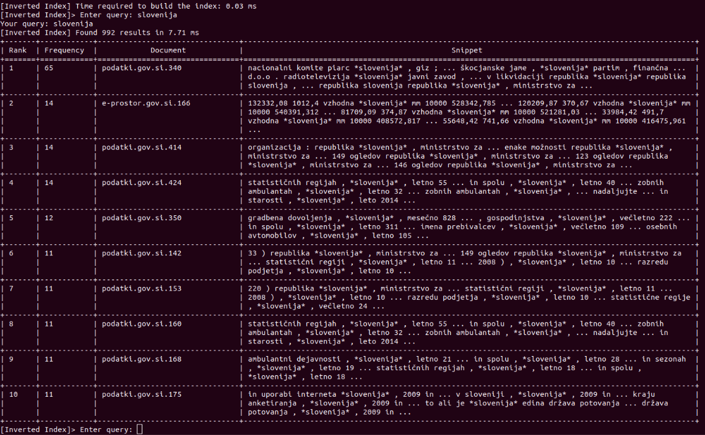

# WIER: Document indexing and querying

## Brief description

This repository consists of an implementation of [Inverted Index](https://en.wikipedia.org/wiki/Inverted_index),
and Sequential Index, i.e. sequentially reading from all files from the corpus and retrieving the results.

It is grouping the results per file and showing snippets of 6 words around the found result:




## Requirements
To run the code you will need to install `Pipenv`:

```bash
brew install pipenv
# or
pip install --user pipenv
```

navigate to `./indexer/` and then:
```bash
cd indexer/
pipenv install
pipenv shell # enters the new environment, very important for running the code

```
## Running
After setting up and entering the newly created environment, run the following:
```bash
# to run a query on the reverse index
python3 indexer.py -i ../input -o ../output --method inverted --query "social services"

# to run a benchmark test with 100 iterations on the inverted index
python3 indexer.py -i ../input -o ../output --method inverted --benchmark 100

# re-create the index and perform a single query
python3 indexer.py -i ../input -o ../output --method inverted --query "social services" --force-recreate

# to run a query on the sequential index with maximum of 2 results:
python3 indexer.py -i ../input -o ../output --method sequential --query "social services" --num-results 2

# enters an interactive mode where you are able to execute multiple queries
# type `help` in interactive mode to list all the options
python3 indexer.py -i ../input -o ../output --interactive

# list all possible options
python3 indexer.py --help
```

Note: at the beginning of the first run it is going to build the index and 
it is going to re-use the same files each time unless a `--force-recreate` is provided.
This is useful when changing the input files.

## Report
**IMPORTANT: THE FOLLOWING FILES IN THE ROOT OF THE REPOSITORY ARE SOFT-LINKED AS DESCRIBED BELOW:**

- `report.pdf` -> `./report/report.pdf`
- `inverted-index.db` -> `./outputs/inverted-index.db`

The report can be found [here](./report/report.pdf).
